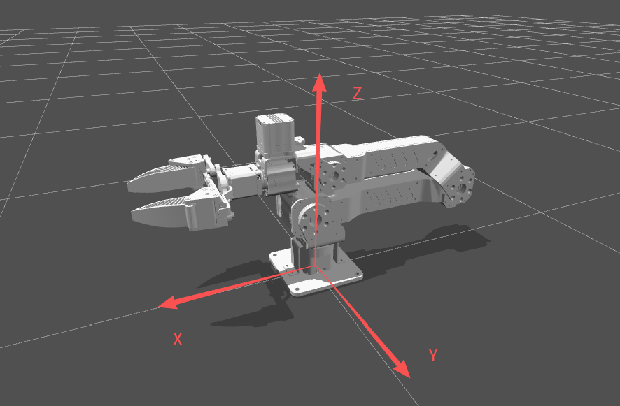

# Panthera 机械臂控制 Python SDK

## 功能特性

- **多种控制模式**:
  - 位置速度控制（含最大力矩限制）
  - 五参数 MIT 模式控制（位置+速度+力矩+Kp+Kd）
  - 夹爪独立控制
- **运动学计算**:
  - 正运动学（FK）
  - 逆运动学（IK）
- **动力学计算**:
  - 重力补偿
  - 科氏力补偿
  - 质量矩阵
  - 摩擦力补偿
  - 完整动力学模型
- **轨迹规划**:
  - 五次多项式插值（速度、加速度连续）
  - 七次多项式插值（速度、加速度、加加速度连续）
  - 带速度约束的七次多项式插值
- **安全功能**:
  - 关节位置限制
  - 力矩限制
  - 超时检测
  - 位置到达检测
- **主从协同控制**：支持双臂协同操作和轨迹记录回放
- **基于 YAML 的配置系统**

## 基座坐标系参考



## 环境安装

### 推荐：使用独立的 conda 环境

为避免与系统环境（如 ROS）冲突，强烈建议创建独立的 conda 环境：

```bash
# 创建新环境（Python 3.9、3.10 或 3.12）
conda create -n panthera python=3.10
conda activate panthera
```

### 安装步骤

> **注意：** 方式1 中的 whl 包在 Ubuntu 22 下编译，若使用 Ubuntu 20 或其他系统出现兼容性问题，请使用方式2 从源码编译。

---

#### 方式1：使用预编译 whl 包（Ubuntu 22 推荐）

**步骤1：安装电机控制 SDK（whl 包）**

在 `motor_whl` 文件夹中选择对应 Python 版本的 whl 文件：

```bash
# Python 3.9
pip install motor_whl/hightorque_robot-1.2.0-cp39-cp39-linux_x86_64.whl

# Python 3.10
pip install motor_whl/hightorque_robot-1.2.0-cp310-cp310-linux_x86_64.whl

# Python 3.11
pip install motor_whl/hightorque_robot-1.2.0-cp311-cp311-linux_x86_64.whl

# Python 3.12
pip install motor_whl/hightorque_robot-1.2.0-cp312-cp312-linux_x86_64.whl
```

---

#### 方式2：从源码编译（Ubuntu 20 或其他系统）

**步骤1：安装系统依赖**

```bash
sudo apt-get install -y \
    cmake \
    python3-dev \
    python3-pip \
    liblcm-dev \
    libyaml-cpp-dev \
    libserialport-dev
```

**步骤2：安装 Python 编译依赖**

```bash
pip install pybind11
```

**步骤3：编译电机 SDK C++ 项目**

```bash
cd ../panthera_cpp/motor_cpp
mkdir -p build && cd build
cmake ..
make
```

**步骤4：编译 Python 绑定**

```bash
cd ../../panthera_python
mkdir -p build && cd build
cmake ..
make
```

编译成功后会显示 `Build target _hightorque_robot`。

---

**步骤2（方式1继续）/ 步骤5（方式2继续）：安装高层库依赖（使用 Panthera_lib 时需要）**

```bash
# 方法1：使用 requirements.txt（推荐）
pip install -r requirements.txt

# 方法2：手动安装
pip install "pyyaml>=6.0"
pip install "pin>=2.6.0"
pip install "scipy>=1.9.0"
```

**重要提示：**
- ✅ 安装 `pin` 包（机器人动力学库），不是 `pinocchio`
- ⚠️ `pinocchio` 是一个测试框架，不是我们需要的包
- ✅ PyYAML 需要 6.0+ 版本才能支持 Python 3.12+
- ✅ 在 conda 环境中使用 `pip`，不要用 `pip3`

**步骤3（方式1）/ 步骤6（方式2）：验证安装**

手动验证：
```bash
python -c "import hightorque_robot; print('✓ 电机 SDK 安装成功')"
python -c "import pinocchio as pin; print('✓ pin 安装成功')"
python -c "import yaml; print('✓ pyyaml 安装成功')"
```

安装成功后，在 `scripts` 目录下运行例程：
```python
# 注意：Panthera_lib 作为源码提供，需要在 scripts 目录下使用
cd scripts
from Panthera_lib import Panthera
```

## 快速开始

### 通信板接线参考


### 赋串口权限
设备正常连接可以看到七个设备
```bash
ls /dev/ttyACM*
```
赋值权限：
```bash
sudo chmod -R 777 /dev/ttyACM*
```

### 测试示例
a. 首次打开先在 `~/Panthera_SDK/panthera_python/scripts` 目录下运行 `0_robot_get_state.py` 脚本，查看各关节状态
```bash
python 0_robot_get_state.py
```
启动成功后会显示端口号、电机ID、和初始化电机的信息，随后循环打印各关节位置、速度等状态。

b. 运行位置速度控制程序
```bash
python 1_Joint_PosVel_control.py
```
机械臂会按指定速度运动到不同位置。若机械臂依次完成动作，则说明工作正常。

### 实现记录与播放轨迹
运行 `5_record_trajectory.py` 脚本，进行主从协同同时记录机械臂运动轨迹。记录完成后按 Ctrl+C 退出程序，轨迹文件会自动保存在当前目录下（命名如 trajectory_20251211_160537.jsonl）。
```bash
python 5_record_trajectory.py
```
随后在 `5_replay_trajectory.py` 脚本内将 TRAJECTORY_FILE 改成刚刚保存好的文件路径，然后运行该脚本，主臂会自动运行记录好的轨迹。
```bash
python 5_replay_trajectory.py
```
若想使用从臂运行轨迹，则将该文件内的 config_path 变量中的 Leader.yaml 路径改成 Follower.yaml。

### 主从遥操
将从臂连接至can口1,主臂连接至can口2
启动程序：
```bash
python 5_teleop_control.py
```
即可看到遥操效果
## 使用示例

### 基础控制示例

```python
from Panthera_lib import Panthera
import numpy as np

# 创建机械臂实例（默认使用Leader配置）
robot = Panthera()

# 或指定配置文件
#robot = Panthera("path/to/Leader.yaml")

# 获取当前关节角度
joint_pos = robot.get_current_pos()
print(f"当前关节角度: {joint_pos}")

# 位置速度控制（6个关节）
target_pos = [0.0, 0.5, -0.5, 0.0, 0.5, 0.0]
target_vel = [0.5, 0.5, 0.5, 0.5, 0.5, 0.5]
max_torque = [10.0, 10.0, 10.0, 5.0, 5.0, 5.0]

# 发送控制命令（单关节位置速度控制）
robot.Joint_Pos_Vel(target_pos, target_vel, max_torque)

# 等待到达目标位置
robot.Joint_Pos_Vel(target_pos, target_vel, max_torque,
                    iswait=True, tolerance=0.01, timeout=15.0)

# 夹爪控制
robot.gripper_open()  # 打开夹爪
# robot.gripper_close(pos=0.0)  # 关闭夹爪
```

## API 参考

### Panthera 类

Panthera 类继承自 `htr.Robot`，提供了机械臂级别的控制接口。

#### 初始化
- `Panthera(config_path=None)` - 创建机械臂实例
  - `config_path`: 配置文件路径，默认使用 Leader.yaml

#### 状态获取
- `get_current_state()` - 获取所有关节状态列表
- `get_current_pos()` - 获取当前关节角度 (np.ndarray [6,])
- `get_current_vel()` - 获取当前关节速度 (np.ndarray [6,])
- `get_current_torque()` - 获取当前关节力矩 (np.ndarray [6,])
- `get_current_state_gripper()` - 获取夹爪状态
- `get_current_pos_gripper()` - 获取夹爪位置
- `get_current_vel_gripper()` - 获取夹爪速度
- `get_current_torque_gripper()` - 获取夹爪力矩

#### 控制命令
- `Joint_Pos_Vel(pos, vel, max_tqu=None, iswait=False, tolerance=0.1, timeout=15.0)`
  - 单关节位置速度最大力矩控制（每个关节独立设置）
  - `pos`: 目标位置数组 [6,] (rad)
  - `vel`: 目标速度数组 [6,] (rad/s)
  - `max_tqu`: 最大力矩数组 [6,] (Nm)，为None时使用配置文件中的默认值
  - `iswait`: 是否等待到达目标
  - `tolerance`: 位置容差 (rad)
  - `timeout`: 超时时间 (s)

- `moveJ(pos, duration, max_tqu=None, iswait=False, tolerance=0.1, timeout=15.0)`
  - 关节空间运动控制（所有关节同步到达目标位置）
  - `pos`: 目标位置数组 [6,] (rad)
  - `duration`: 运动时间 (s)
  - `max_tqu`: 最大力矩数组 [6,] (Nm)，为 None 时使用配置文件中的默认值
  - `iswait`: 是否等待到达目标
  - `tolerance`: 位置容差 (rad)
  - `timeout`: 超时时间 (s)

- `pos_vel_tqe_kp_kd(pos, vel, tqe, kp, kd)`
  - 五参数MIT控制模式
  - `pos`: 目标位置 [6,] (rad)
  - `vel`: 目标速度 [6,] (rad/s)
  - `tqe`: 前馈力矩 [6,] (Nm)
  - `kp`: 位置增益 [6,]
  - `kd`: 速度增益 [6,]

- `gripper_control(pos, vel, max_tqu)` - 夹爪位置速度控制
- `gripper_control_MIT(pos, vel, tqe, kp, kd)` - 夹爪MIT控制
- `gripper_open(vel=0.5, max_tqu=0.5)` - 打开夹爪
- `gripper_close(pos=0.0, vel=0.5, max_tqu=0.5)` - 关闭夹爪

#### 位置检测
- `check_position_reached(target_positions, tolerance=0.1)` - 检查是否到达目标
- `wait_for_position(target_positions, tolerance=0.01, timeout=15.0)` - 等待到达目标

#### 运动学
- `forward_kinematics(joint_angles=None)` - 正运动学
  - 返回: `{'position': [x,y,z], 'rotation': R, 'transform': T, 'joint_angles': q}`

- `inverse_kinematics(target_position, target_rotation=None, init_q=None, max_iter=1000, eps=1e-4)` - 逆运动学
  - `target_position`: 目标位置 [x, y, z] (m)
  - `target_rotation`: 目标旋转矩阵 3x3 (可选)
  - `init_q`: 初始关节角度 (可选)
  - 返回: 关节角度解 [6,] 或 None

#### 动力学
- `get_Gravity(q=None)` - 重力补偿力矩 G(q)
- `get_Coriolis(q=None, v=None)` - 科氏力矩阵 C(q,v)
- `get_Coriolis_vector(q=None, v=None)` - 科氏力向量 C(q,v)*v
- `get_Mass_Matrix(q=None)` - 质量矩阵 M(q)
- `get_Inertia_Terms(q=None, a=None)` - 惯性力矩 M(q)*a
- `get_Dynamics(q=None, v=None, a=None)` - 完整动力学 τ = M(q)a + C(q,v)v + G(q)
- `get_friction_compensation(vel=None, Fc=None, Fv=None, vel_threshold=0.01)` - 摩擦力补偿
  - 摩擦模型: τ_friction = Fc * sign(vel) + Fv * vel

#### 轨迹规划
- `quintic_interpolation(start_pos, end_pos, duration, current_time)`
  - 五次多项式插值（速度、加速度连续）
  - 返回: (位置, 速度, 加速度)

- `septic_interpolation(start_pos, end_pos, duration, current_time)`
  - 七次多项式插值（速度、加速度、加加速度连续）
  - 返回: (位置, 速度, 加速度)

- `septic_interpolation_with_velocity(start_pos, end_pos, start_vel, end_vel, duration, current_time)`
  - 带速度约束的七次多项式插值
  - 返回: (位置, 速度, 加速度)

#### 继承的基础方法
- `motor_send_cmd()` - 发送控制命令到电机
- `send_get_motor_state_cmd()` - 请求电机状态
- `set_stop()` - 停止所有电机
- `set_reset()` - 重启所有电机
- `set_timeout(timeout_ms)` - 设置超时时间

### 电机参数配置 (motor_param/*.yaml)
包含电机ID、CAN总线配置、电机型号等底层参数。

## 项目结构

```
panthera_python/
├── motor_whl/                  # 预编译whl包
│   ├── hightorque_robot-1.2.0-cp39-cp39-linux_x86_64.whl
│   ├── hightorque_robot-1.2.0-cp310-cp310-linux_x86_64.whl
│   ├── hightorque_robot-1.2.0-cp311-cp311-linux_x86_64.whl
│   └── hightorque_robot-1.2.0-cp312-cp312-linux_x86_64.whl
│
├── Panthera-HT_description/    # 机械臂URDF模型
│   ├── urdf/                   # URDF文件
│   ├── meshes/                 # 3D模型文件
│   ├── config/                 # 配置文件
│   └── launch/                 # 启动文件
│
├── robot_param/                # 机械臂配置文件
│   ├── Leader.yaml             # 主臂配置
│   ├── Follower.yaml           # 从臂配置
│   └── motor_param/            # 电机参数
│       ├── 6dof_Panthera_params_leader.yaml
│       ├── 6dof_Panthera_params_follower.yaml
│       ├── motor_1.yaml
│       ├── motor_6.yaml
│       └── robot_config.yaml
│
├── scripts/                    # 控制脚本
│   ├── Panthera_lib/           # 高层封装库
│   │   ├── Panthera.py         # Panthera类定义
│   │   ├── recorder.py         # 轨迹记录工具
│   │   └── __init__.py         # 模块初始化
│   │
│   ├── 0_robot_get_state.py    # 状态查看
│   ├── 0_robot_set_zero.py     # 设置零位
│   │
│   ├── 1_Joint_PosVel_control.py           # 单关节位置速度控制
│   ├── 1_Joint_Vel_control.py              # 速度控制
│   ├── 1_Joint_PD_control.py               # PD控制
│   ├── 1_moveJ_control.py                  # 关节空间运动控制 (moveJ)
│   ├── 1_forward_kinematics_test.py        # 正运动学测试
│   ├── 1_inverse_kinematics_test.py        # 逆运动学测试
│   │
│   ├── 2_inv_PosVel_control.py             # 基于逆运动学的位置控制
│   ├── 2_gravity_compensation_control.py   # 重力补偿控制
│   ├── 2_gravity_friction_compensation_control.py  # 重力摩擦力补偿控制
│   ├── 2_Jointimpendence_control_with_gra_pd.py    # 关节阻抗控制(重力+PD)
│   ├── 2_Jointimpendence_control_with_gra_fri_pd.py # 关节阻抗控制(重力+摩擦力+PD)
│   │
│   ├── 3_interpolation_control_zeroVel.py   # 插值轨迹控制(零速度)
│   ├── 3_interpolation_control_nozeroVel.py # 插值轨迹控制(非零速度)
│   ├── 3_sin_trajectory_control.py          # 正弦轨迹控制
│   ├── 3_gravity_compensation_with_fk.py    # 重力补偿+正运动学
│   │
│   ├── 4_impedance_trajectory_control_with_gra_pd.py  # 基于轨迹的阻抗控制
│   │
│   ├── 5_teleop_control.py     # 主从臂遥操作
│   ├── 5_record_trajectory.py  # 轨迹记录
│   ├── 5_replay_trajectory.py  # 轨迹回放
│   │
│   ├── 6_moveL_pos_control.py  # 笛卡尔空间直线运动控制
│   ├── 6_moveL_rotate_control.py # 笛卡尔空间旋转运动控制
│   │
│   ├── 7_keyboard_cartesian_pos_control.py  # 键盘控制笛卡尔空间位姿（IK求解）
│   ├── 7_keyboard_cartesian_vel_control.py  # 键盘控制末端速度（雅可比矩阵）
│   │
│   └── motor_example/          # 底层电机控制示例
│       ├── 01_motor_get_status.py
│       ├── 02_position_control.py
│       ├── 03_velocity_control.py
│       ├── 04_torque_control.py
│       ├── 05_voltage_control.py
│       ├── 06_current_control.py
│       ├── 07_pos_vel_maxtorque_control.py
│       ├── 08_pos_vel_torque_kp_kd_control.py
│       ├── 09_set_zero.py
│       ├── motor_control.py
│       └── motor_README.md
│
├── images/                     # 图片资源
├── requirements.txt            # Python依赖
├── setup.py                    # 安装脚本
├── pyproject.toml              # 项目配置
└── README.md                   # 本文档
```

## 故障排除

### URDF加载失败
检查配置文件中的URDF路径是否正确，确保相对路径从配置文件所在目录计算。

### 逆运动学不收敛
检查目标位置是否在机械臂工作空间内，可以调整 `max_iter` 和 `eps` 参数。

### 电机无法连接
检查板子开关情况，电机电源按钮亮绿灯则为上电
若依旧无法连接请检查电机之间连接线情况


## 小技巧
自动赋值串口权限
a.修改udev规则文件：
```bash
sudo gedit /etc/udev/rules.d/99-tegra-devices.rules
```
b.添加如下内容，并保存：
```bash
KERNEL=="ttyACM*", MODE="0777"
```
c.
重新加载udev规则：
```bash
sudo udevadm control --reload-rules
```
重新连接电脑和主板即可生效。


## 常见问题
1.ibserialport.so.0缺失
更新包列表
sudo apt-get update

安装 libserialport 开发库
sudo apt-get install libserialport-dev

检查安装的文件
dpkg -L libserialport-dev | grep "\.so"

2.导入hightorque_robot失败: libyaml-cpp.so.0.6: cannot open shared object file: No such file or directory
请确保已安装hightorque_robot whl包
安装方法: pip install hightorque_robot-*.whl
 # 检查库文件是否正确安装
ls -la /usr/local/lib/libyaml-cpp*

应该看到类似输出：
libyaml-cpp.so -> libyaml-cpp.so.0.7
 需要换成libyaml-cpp.so.0.6.0
cd ~
删除之前0.7的版本
sudo rm /usr/local/lib/libyaml-cpp.so.0.7
sudo rm /usr/local/lib/libyaml-cpp.so.0.7.0
克隆仓库到用户主目录
cd ~
git clone https://github.com/jbeder/yaml-cpp.git
cd yaml-cpp
git checkout yaml-cpp-0.6.1

创建干净的构建目录
mkdir build
cd build

配置编译选项
cmake .. -DCMAKE_BUILD_TYPE=Release -DBUILD_SHARED_LIBS=ON

编译
make -j$(nproc)

安装
sudo make install

更新库缓存
sudo ldconfig


## 许可证

MIT License

## 贡献

欢迎提交Issue和Pull Request!

## 联系方式

如有问题，请提交Issue或联系维护者。